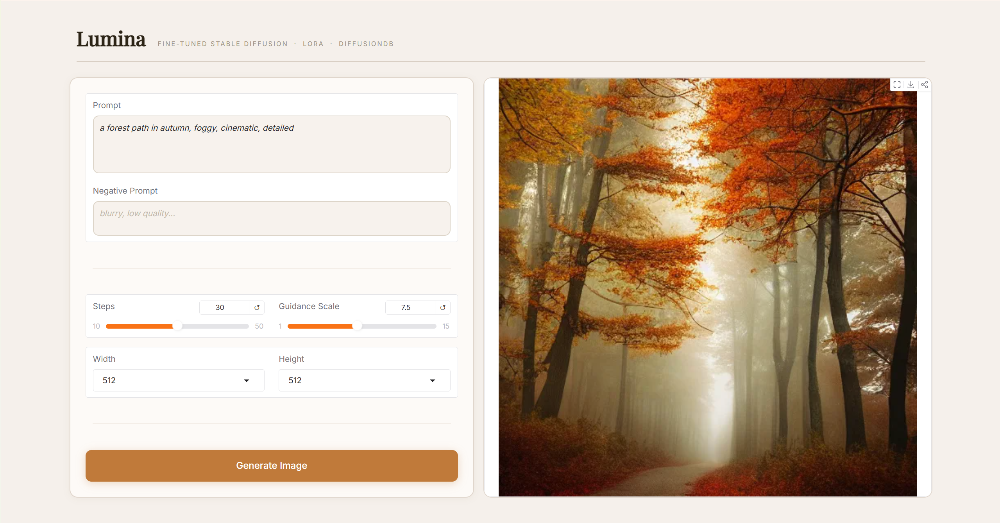
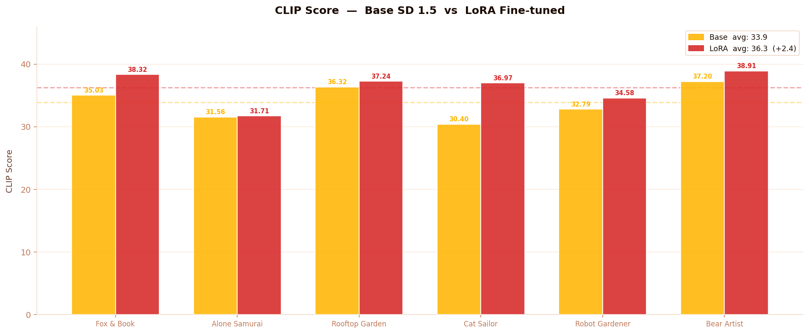
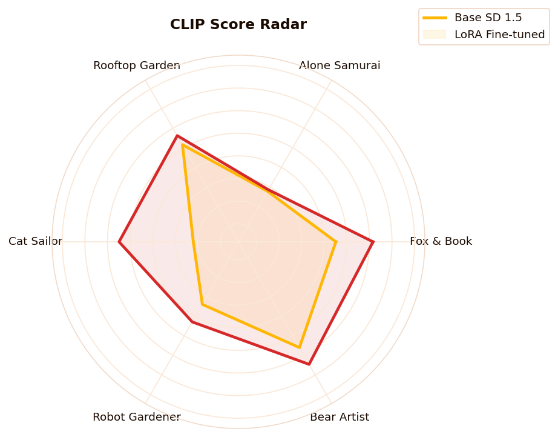
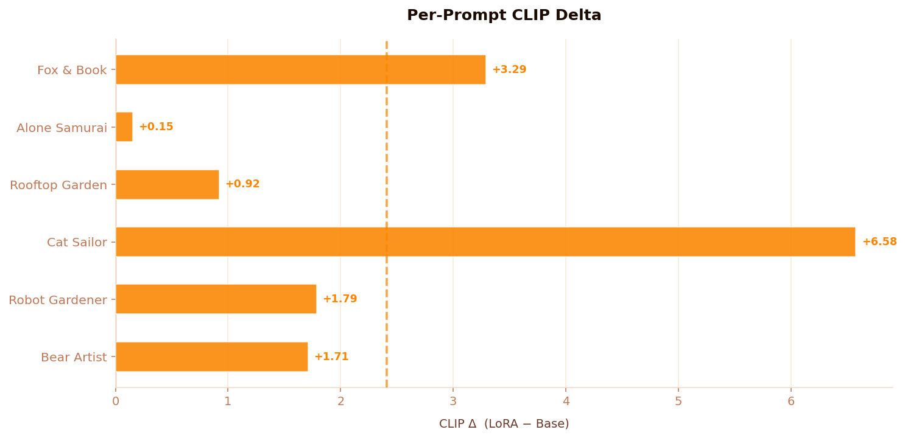

# Lumina — LoRA Fine-tuned Stable Diffusion

[](https://www.python.org/)
[](https://pytorch.org/)
[](https://huggingface.co/docs/diffusers)
[](https://github.com/huggingface/peft)
[](https://www.gradio.app/)
[](LICENSE)

A LoRA fine-tuning pipeline for **Stable Diffusion 1.5**, trained on 8,000 samples from [DiffusionDB](https://github.com/poloclub/diffusiondb). Includes a full training loop with GPU thermal management, evaluation suite with CLIP + aesthetic scoring, and a custom Gradio web UI called **Lumina**.

---

## Demo



---

## Results

LoRA fine-tuning improved **CLIP score by +2.4** (33.9 → 36.3) with a **100% win rate** across all 6 test prompts, while maintaining aesthetic quality.

| Metric | Base SD 1.5 | LoRA Fine-tuned | Delta |
|---|---|---|---|
| CLIP Score (avg) | 33.9 | 36.3 | **+2.4** |
| Aesthetic Score (avg) | 5.41 | 5.43 | +0.03 |
| CLIP Win Rate | 50% | **100%** | +50% |

### Evaluation Charts

> Place evaluation images in `assets/eval/`:
> ```
> assets/eval/
> ├── 01_clip_scores.png
> ├── 02_radar.png
> ├── 03_before_after.png
> ├── 04_delta.png
> ├── 05_aesthetic.png
> └── 06_dashboard.png
> ```

| CLIP Scores | Radar | Per-Prompt Delta |
|---|---|---|
| |  |  |

**Before / After comparison:**


---

## Project Structure

```
TextToImage/
├── configs/
│   └── config.yaml          # All hyperparameters
├── diffusiondb_8000/         # Dataset (not tracked by git)
├── outputs/
│   ├── checkpoint-32000/    # Training checkpoints
│   └── eval_v2/             # Evaluation outputs
├── src/
│   ├── __init__.py
│   ├── dataset.py           # DiffusionDB dataset loader
│   ├── model.py             # SD model loading + LoRA setup
│   ├── trainer.py           # Training loop with GPU management
│   └── utils.py             # Config, logging, seed utilities
├── app.py                   # Gradio web UI (Lumina)
├── train.py                 # Training entry point
├── inference.py             # Single-image inference script
├── evaluate.py              # CLIP + aesthetic evaluation
├── download_dataset.py      # DiffusionDB download helper
├── run_all.py               # End-to-end pipeline runner
└── requirements.txt
```

---

## Installation

```bash
git clone https://github.com/sonamansuryan/text-to-image-engine.git
cd text-to-image-engine

pip install -r requirements.txt
```

**Optional — memory-efficient attention (recommended for GPUs with < 12GB VRAM):**
```bash
pip install xformers
```

**Requirements overview:** Python 3.10+, CUDA-capable GPU (tested on RTX 3090), CUDA 11.8+

---

## Quick Start

### 1. Download Dataset

```bash
python download_dataset.py
```

This downloads 8,000 image-prompt pairs from DiffusionDB into `./diffusiondb_8000/`.

### 2. Train

```bash
python train.py --config configs/config.yaml
```

Training runs for 3 epochs with cosine LR schedule and automatic GPU cooling pauses between epochs. Checkpoints are saved every 200 steps to `./outputs/`.

### 3. Run Inference

```bash
python inference.py \
  --prompt "a fantasy castle on a mountain, cinematic, 4k" \
  --lora_path ./outputs \
  --output_path ./outputs/result.png
```

### 4. Launch Web UI

```bash
python app.py
```

Open `http://localhost:7860` — the **Lumina** interface will be ready.

### 5. Evaluate

```bash
python evaluate.py
```

Generates CLIP score and aesthetic score comparisons between base SD 1.5 and your fine-tuned model. Results are saved to `./outputs/eval_v2/`.

---

## Configuration

All hyperparameters live in `configs/config.yaml`:

```yaml
lora:
  rank: 4
  alpha: 32
  dropout: 0.1
  target_modules: [to_q, to_k, to_v, to_out.0]

training:
  num_train_epochs: 3
  train_batch_size: 1
  gradient_accumulation_steps: 8
  learning_rate: 1.0e-4
  mixed_precision: fp16
  epoch_cooldown_seconds: 300   
  gpu_temp_limit: 83           
```

Key decisions: LoRA rank 4 keeps the adapter lightweight (~3MB). Gradient accumulation of 8 simulates batch size 8 on a single GPU. The cooling system prevents thermal throttling on long runs.

---

## Training Details

- **Base model:** `runwayml/stable-diffusion-v1-5`
- **Dataset:** DiffusionDB (8,000 samples)
- **LoRA targets:** Q, K, V, output projection in UNet attention layers
- **Optimizer:** AdamW (β₁=0.9, β₂=0.999, weight decay=0.01)
- **LR schedule:** Linear warmup (100 steps) → Cosine annealing
- **Mixed precision:** FP16
- **Gradient checkpointing:** Enabled
- **Checkpoint resume:** Automatic — re-running `train.py` continues from the latest checkpoint

---

## Evaluation Methodology

The `evaluate.py` script runs 6 test prompts through both the base model and the LoRA model, then scores each output with:

- **CLIP Score** — measures text-image alignment using `openai/clip-vit-base-patch32`
- **LAION Aesthetic Score** — predicts perceptual quality using the LAION aesthetic predictor

Test prompts used:
- *"a little fox reading a glowing book under a mushroom in a rainy forest"*
- *"a lone samurai standing in a bamboo forest in heavy rain"*
- *"a young girl tending a rooftop garden above a misty city at dawn"*
- *"a small cat in a sailor outfit steering a wooden boat on a calm ocean"*
- *"smart robot gardener tending flowers"*
- *"a bear in a knitted sweater painting a self-portrait in an autumn forest studio"*

---

## Web UI — Lumina

The Gradio interface (`app.py`) supports:

- Custom prompt + negative prompt
- Inference steps (10–50) and guidance scale (1–15)
- Output resolution: 512, 640, or 768px
- LoRA weights are loaded automatically from `./outputs` — uncomment the `PeftModel` line in `app.py` to enable

---

## License

MIT License — see [LICENSE](LICENSE) for details.
